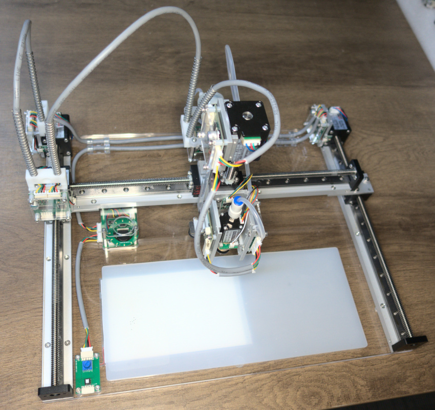
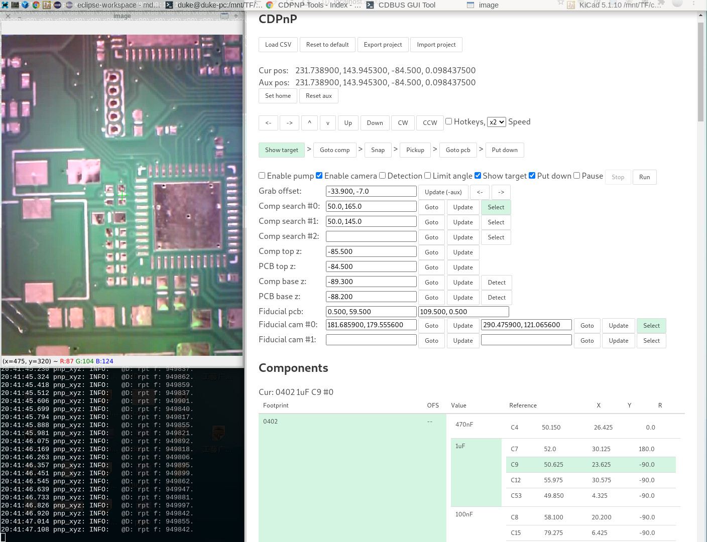
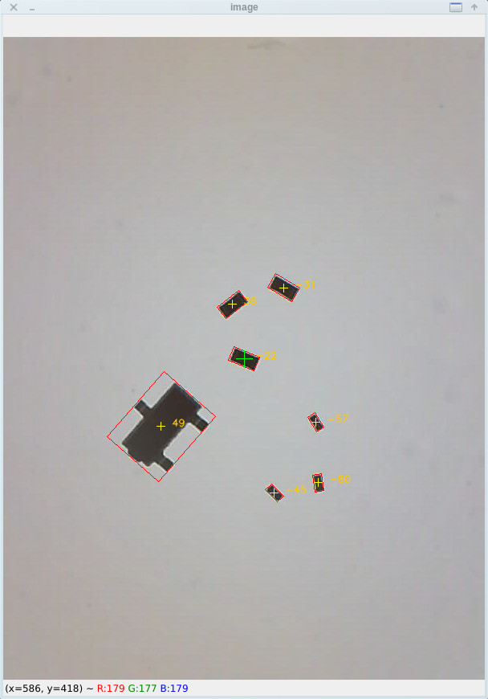

CD-PnP
=======================================

The CD-PnP is an SMT assistant tool, not a fully automatic SMT machine.

Fully automatic SMT machines are much more complicated to configure,
requiring the configuration of feeders and the configuration of components in the software,
and the machine is much larger.

This semi-automatic machine is simple to configure, just import the KiCad generated position file,
place one or more PCBs, use the camera to mark any two reference points on each PCB and you are ready to go.
The components basically do not need to be configured in advance. 

For ICs with dense pins, especially BGA packages,
it is advisable to check the position manually before placing them down, either with a keyboard or a joystick.
If you place them directly by hand, it is not easy to align them and they are prone to hand shake.

### Hardware

The hardware is modular in design. A CDBUS (RS-485) bus is used to connect all modules to the PC, including the camera. (10 Mbps by default.)

The machine has four degrees of freedom: X, Y, Z, R (rotate), and is controlled by multiple stepper motor controllers.
(May be upgraded to FOC servo motors in the future.)

The Y-axis is controlled by two motor controllers, synchronised by multicasting.

The Z-axis contains a strain gauge sensor, the sensor data is relayed through the R-axis controller, as the sensor is closest to the R-axis.

The machine automatically picks up component from a pre-defined search areas and put it onto the PCB in the corresponding position.

Whenever the machine has finished with the same value of components,
it will automatically pause and wait for the user to change the components in the search area.

  

The stepper motor controllers and camera mentioned above are all open source projects.
Available at: https://github.com/dukelec/cdbus_gui

In the future, it is possible to consider adding more cameras, parts to automatically change the nozzle,
and parts to automatically flip the resistors and other components.

### User Interface

The components list can be dragged and sorted.

Click on a component in the list and the camera will automatically move to it.

Click on the run button to start the semi-automatic SMT placement process.

  

Also supports more than two PCBs, which are automatically hidden in the picture.

The following pictures show the recognition of the 0402, 0201 and sot23 footprints for reference only.
In practice, only components with same value can be placed at any one time.

  

#### Download this GUI tool:
`git clone --recurse-submodules https://github.com/dukelec/cd_pnp.git`

#### Update:
`git pull --recurse-submodules`

#### Dependence:
Python version >= 3.8  
`pip3 install pythoncrc websockets pyserial u-msgpack-python aiohttp`

#### Usage:
Run `pnp_main.py` or `start.sh`, then open url in your web browser: http://localhost:8900

Test without hardware: `./pnp_main.py --debug --dev None`

App shortcuts: [doc/shortcuts.md](doc/shortcuts.md)

The protocols between mcu, python, and web page please refer to the [CDBUS_GUI](https://github.com/dukelec/cdbus_gui) project.

