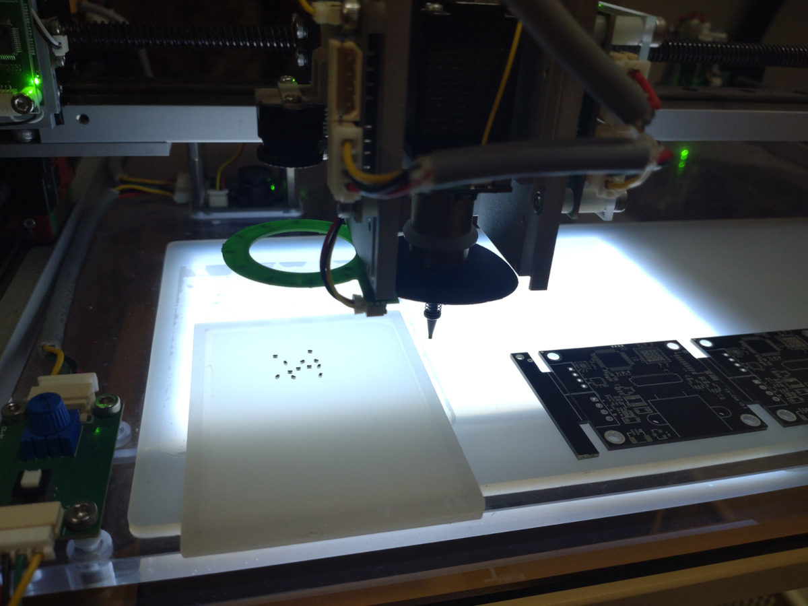

CDPnP
=======================================

CDPnP is a compact, desktop, semi-automatic SMT prototyping machine.

Traditional SMT machines are cumbersome to configure. When making prototypes,
setup often takes several hours, while the placement process only takes a few minutes.

This semi-automatic machine is easy to set up: simply import the position file in KiCad .csv format (other software formats are also supported),
place one or more PCBs, and use the camera to mark two reference points on each PCB. No component setup is required.

For ICs with very dense pins, especially BGA packages,
it is recommended to manually check the position before placement and use the keyboard to adjust the position and angle.
Placing them by hand can make alignment difficult and may result in misplacement due to hand tremors.

[Discussions](https://github.com/dukelec/cdpnp/discussions) for this project are now enabled. Feel free to join and get more information.

### Hardware

The hardware is modular in design, with a CDBUS (RS-485) bus connecting all modules to the PC, including two cameras (10 Mbps by default).

The machine has four degrees of freedom: X, Y, Z, and R (rotation), each with a homing switch. It is controlled by multiple stepper motor controllers.

The Y-axis is controlled by two motor controllers, synchronized via multicasting.

The Z-axis contains a strain gauge-based force sensor, with sensor data relayed through the R-axis controller, as the sensor is located closest to the R-axis.

The machine automatically picks up components from predefined search areas and places them onto the PCB in the corresponding positions.  
However, it does not recognize the component models on the tray, so the user must place the correct components according to the instructions.

Once the machine finishes placing components of the same model, it automatically pauses and waits for the user to replace the components in the search area.

While the machine is placing components, the user can prepare the next few models on separate trays in advance and quickly replace the trays for loading,
enabling parallel operation between the machine and the operator.

The stepper motor controllers, cameras, and others are open-source projects available at: https://github.com/dukelec/cdbus_doc

### User Interface

The list of components can be dragged and sorted.

Click on a component to move the camera automatically to its position.

Press the run button to start the semi-automatic SMT placement process.

  

It also supports more than two PCBs, with additional blank items automatically hidden in the software.

The following images show the recognition of 0402, 0201, and SOT23 footprints for testing purposes only.
In practice, only components of the same model can be placed at one time.

  

#### Download this GUI tool:
`git clone --recurse-submodules https://github.com/dukelec/cdpnp.git`

#### Update:
`git pull --recurse-submodules`

#### Dependence:
Python version >= 3.8  
`pip3 install pythoncrc websockets pyserial u-msgpack-python aiohttp opencv-python scipy`

#### Usage:
Run `pnp_main.py` or `start.sh`, then open the following URL in your web browser: http://localhost:8900

Test without hardware: `./pnp_main.py --debug --dev None`

App shortcuts: [doc/shortcuts.md](doc/shortcuts.md)

